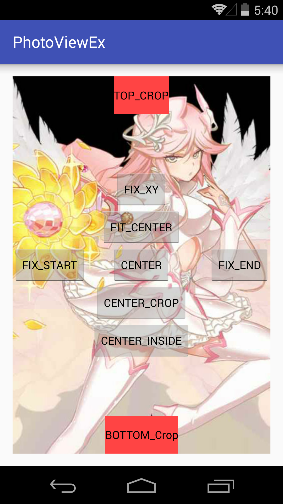
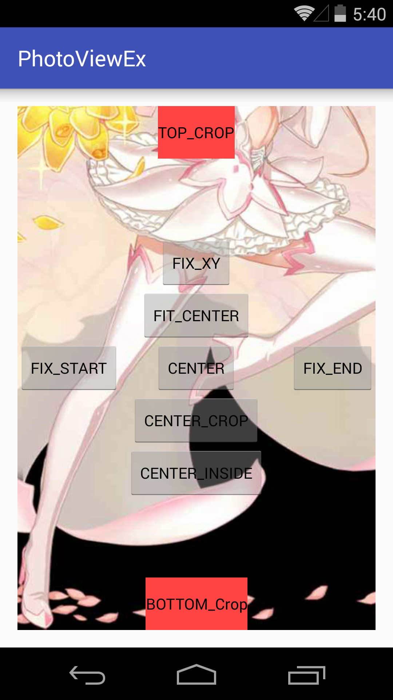

#PhotoViewEx

A [PhotoView](https://github.com/chrisbanes/PhotoView) include TOP_CROP and BOTTOM_CROP.also works in VerticalViewPager.

link to [PhotoView](https://github.com/chrisbanes/PhotoView).

#Useage

##Step 1.

    compile 'com.github.chrisbanes.photoview:library:1.2.4'

##Step 2.

copy PhotoViewAttacherEx.java into your Project.

##Step 3.

    private PhotoViewAttacherEx mAttacher;

    ...

    mAttacher = new PhotoViewAttacherEx(mImageView);

    ...

    mAttacher.setScaleType(PhotoViewAttacherEx.ScaleTypeEx.TOP_CROP);
    mAttacher.setScaleType(PhotoViewAttacherEx.ScaleTypeEx.BOTTOM_CROP);

#License

    This project is licensed under the MIT License.have fun.